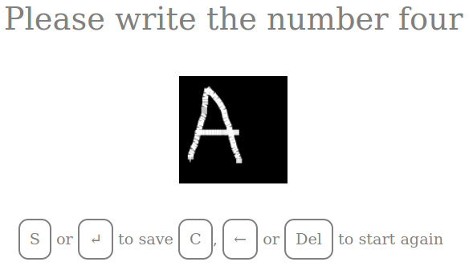
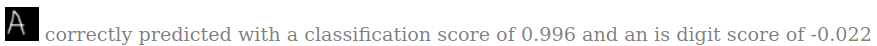

# make your own hand drawn digits and characters

myohddac is;
- a web app that makes it easy to "make your own hand drawn digits and characters"
    - that will work with the fastai MNIST png dataset
- some tools to help working with the images created by the web app
- an exploration into building a system that can 
    - classify hand drawn digits and 
    - recognise things that are not digits

The following screenshot shows the UI asking for a 4 but we've drawn an A:

When we save, we see that the classifier thinks its done a great job but the "is digit" score tells us otherwise:

## Notes
In this README, {myohddac_home} means the location of this project in your file system.
- e.g. /Users/Someone/Projects/myohddac or C:\Users\Someone\Projects\myohddac

Please note: No attempt has been made to make the web app secure

## Dependencies
- starlette and uvicorn if you want to run the web app
    - if fastai is installed, the web app will predict what number has been drawn before saving
- matplotlib if you want to run plot_numbers.py
- fastai and jupyter if you want to run the notebooks

If you need it, https://course.fast.ai/index.html is a great place to get started with fastai.

## To run the web app locally
- cd {myohddac_home}
- uvicorn myohddac:app --reload

Image files will be saved to: {myohddac_home}/images
- see myohddac.py if you need to change this

## To plot a selection of images
- cd {myohddac_home}
- python plot_numbers.py

## To make predictions with your images
- Run: notebooks/011_mnist_inference.ipynb
